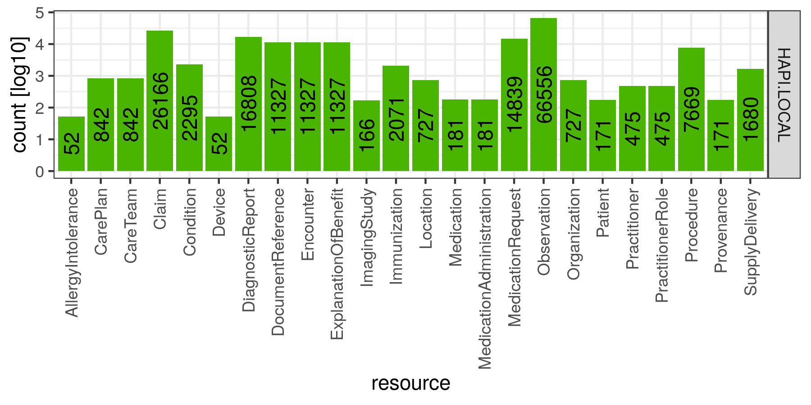

# SyntheaHapiTestEnvironment
### Environment for Tests with Synthea and a local HAPI-FHIR-Server

## Sources:

### HAPI-FHIR-Server-CLI
  - Documentation: https://hapifhir.io/hapi-fhir/docs/tools/hapi_fhir_cli.html  
  - Download: https://github.com/jamesagnew/hapi-fhir/releases

### Synthea
  - Documentation: https://github.com/synthetichealth/synthea/wiki/Basic-Setup-and-Running  
  - Download: https://github.com/synthetichealth/synthea/releases/download/master-branch-latest/synthea-with-dependencies.jar


## Workflow for Linux Systems

### 1. Download and extract Software!
**Run only once!**  
This may take 5 to 10 minutes.
```
$ ./download_and_extract_software.sh
```
Afterwards you should have 2 new directories and some new files in them.    
```
.
├── hapi
│   ├── hapi-fhir-cli
│   ├── hapi-fhir-cli.cmd
│   └── hapi-fhir-cli.jar
└── synthea
    └── synthea-with-dependencies.jar
```

### 2. Create Resources! (171 Patients)
**Run only once!**  
This may take about 1 minute.  
```
$ ./create_resources.sh
```
  
### 3. Start the Server!
**Run whenever the server should get started!**  
This may take about 1 minute.  
```
$ ./start_server.sh
```
  
### 4. Change into a new shell!
In most Terminals the shortcut *CTRL+T* aka *CTRL-SHIFT-t* will do the job.
  
### 5. Send Resources to Server!
**Run only once!**  
*Caution !!!*  
This may take 10 minutes to 1 hour.  
```
$ ./send_resources_to_server.sh
```

## From now on

If you restart your computer you only have to start the server again and
you'll have a fix data set of 171 Patients with many related resources available via
FHIR-Search at localhost:8080/baseR4.

A Web-Tool is also provided and accessible under [localhost:8080](http://localhost:8080).
  
### 6. Do whatever you want!
  
...  

### 7. When it is no longer needed kill the Server!
Change into first shell where the server was started in and press *CTRL-c*!
  
## Statistics of Data Base you'll have got


